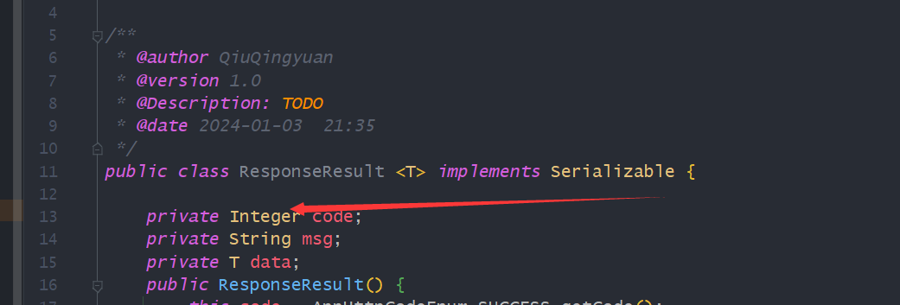
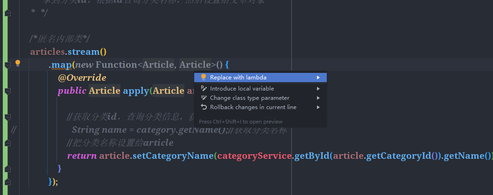

### 示例：

​		[个人博客](http://118.195.213.131/#/Share?classId=16)

​		[天青色博客](http://114.132.81.250:8085/#/Home)

若不设置枚举，若需要统一返回值（为0），则需要逐个修改，代码可维护和复用性不高

~~~Java
public enum AppHttpCodeEnum {
        // 成功
        SUCCESS(200,"操作成功"),
        // 登录
        NEED_LOGIN(401,"需要登录后操作"),
        NO_OPERATOR_AUTH(403,"无权限操作"),
        SYSTEM_ERROR(500,"出现错误"),
        USERNAME_EXIST(501,"用户名已存在"),
        PHONENUMBER_EXIST(502,"手机号已存在"), EMAIL_EXIST(503, "邮箱已存在"),
        REQUIRE_USERNAME(504, "必需填写用户名"),
        LOGIN_ERROR(505,"用户名或密码错误");
        int code;
        String msg;
        AppHttpCodeEnum(int code, String errorMessage){
        this.code = code;
        this.msg = errorMessage;
        }
        public int getCode() {
        return code;
        }
        public String getMsg() {
        return msg;
        }
}
~~~

前后端联调

跨域问题

优化相应数据（前端用不到这么多数据）

便于描述后续的父子分类关系

### 22.分类问题解决——Stream流

~~~java
   @Override
    public ResponseResult articleList(Integer pageNum, Integer pageSize, Long categoryId) {
        //查询条件
        LambdaQueryWrapper<Article> lambdaQueryWrapper = new LambdaQueryWrapper<>();
        // 如果 有categoryId 就要 查询时要和传入的相同
        lambdaQueryWrapper.eq(Objects.nonNull(categoryId)&&categoryId>0 ,Article::getCategoryId,categoryId);
        // 状态是正式发布的
        lambdaQueryWrapper.eq(Article::getStatus,SystemConstants.ARTICLE_STATUS_NORMAL);
        // 对isTop进行降序
        lambdaQueryWrapper.orderByDesc(Article::getIsTop);
        //分页查询
        Page<Article> page = new Page<>(pageNum,pageSize);
        page(page,lambdaQueryWrapper);
        List<Article> articles = page.getRecords();
        //查询categoryName
        articles = articles.stream()
                .map(article -> {
                    article.setCategoryName(categoryService.getById(article.getCategoryId()).getName());
                    return article;
                })
                .collect(Collectors.toList());
        //封装查询结果
        List<ArticleListVo> articleListVos = BeanCopyUtils.copyBeanList(articles, ArticleListVo.class);

        PageVo pageVo = new PageVo(articleListVos,page.getTotal());
        return ResponseResult.okResult(pageVo);
    }
~~~

